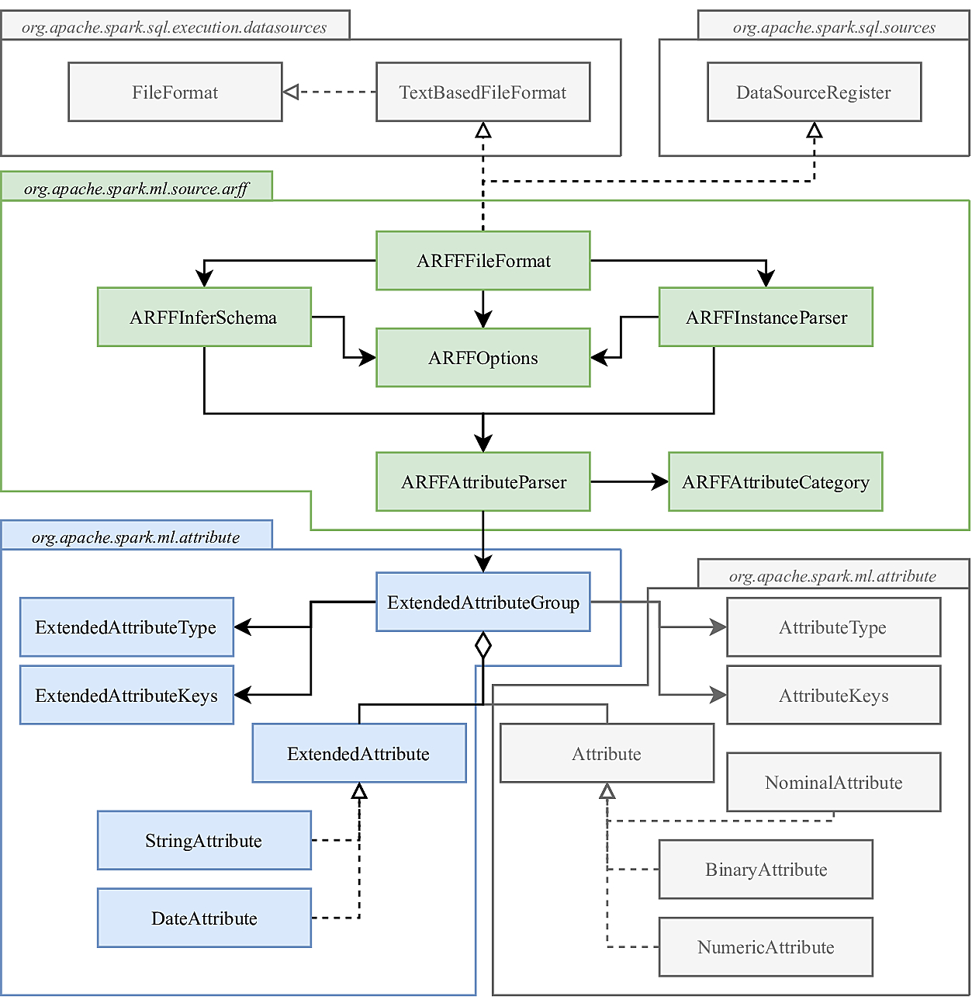

# ARFF Data Source in Apache Spark

The data source API at a high level is an API for turning data from various sources into Spark DataFrames and facilitates to manage the structured data in any format. Apache Spark has some built-in data sources such as Avro, Parquet, LibSVM, ORC, Parquet, JSON, JDBC, etc. Out of those data sources, LibSVM is the only data source specifically designed for machine learning applications. However, this format is unable to specify information about the attributes, thus limiting its application to real-valued attributes and traditional classification/regression paradigms.

Here we present a native data source to support the  Attribute-Relation File Format ([ARFF](https://weka.wikispaces.com/ARFF%20%28stable%20version%29)) on Apache Spark. This data source infers additional information about the attributes, supporting different types of data (without using any [Transformer](https://spark.apache.org/docs/latest/ml-features.html#feature-transformers)) and relations which define new learning paradigms, including multi-instance and multi-output learning. The implementation extends seamlessly the Apache Spark source code, therefore the DataFrame is created using the same syntax as with the official supported formats. 

# Documentation

   * [Learning paradigms](#learning-paradigms)
   * [Attribute-Relation File Format (ARFF)](#attribute-relation-file-format-arff)
      * [Header](#header)
         * [Definition of learning paradigms](#definition-of-learning-paradigms)
      * [Data](#data)
   * [Data source](#data-source)
      * [ARFFFileFormat](#arfffileformat)
      * [ARFFOptions](#arffoptions)
      * [ARFFInferSchema](#arffinferschema)
      * [ExtendedAttributeGroup](#extendedattributegroup)
      * [ARFFInstanceParser](#arffinstanceparser)
   * [Datasets links](#datasets-links)
   * [API](#api)
   * [Examples](#examples)


# Learning paradigms

In **traditional learning**, one object is represented by a single instance and associated with only one label. The problem is called classification whenever the output label is a nominal value (class), or regression if it's a real-valued number. The following table represents an example of each case:

<table>
 <tr><th>Traditional learning</th></tr>
<tr><td>
<table>
 <tr><th>Classification</th><th>Regression</th></tr>
<tr><td>
 
|Instance|Label|
|---|---|
|x<sub>1</sub>|Class A|
|x<sub>2</sub>|Class A|
|x<sub>3</sub>|Class B|
|x<sub>4</sub>|Class C|

</td><td>

|Instance|Label|
|---|---|
|x<sub>1</sub>|0.25|
|x<sub>2</sub>|0.45|
|x<sub>3</sub>|0.15|
|x<sub>4</sub>|0.85|

</td></tr> </table>
</td></tr> </table>

Although the above formalization is prevailing and successful, there are many real-world problems which do not fit this representation well, where a real-world object may be associated with a number of instances and/or labels simultaneously. Some examples are image classification, text categorization, ecological modeling, stock predictions, prediction of drug molecule activity level, etc.

In **multi-output learning**, one object is represented by a single instance which is associated to a set of labels simultaneously. In multi-output classification, also known as multi-label classification, the algorithm learns the set of labels present in each instance. These labels are often represented as a binary vector where each value can be *1* if the label is present and *0* otherwise. In multi-output regression, also known as multi-target regression, the algorithm learns the labels as a set of real-valued numbers. The following table presents a small example of each paradigm:

<table>
 <tr><th>Multi-output learning</th></tr>
<tr><td>
<table>
 <tr><th>Multi-label Classification</th><th>Multi-target Regression</th></tr>
<tr><td>
 
|Instance|Labels|Binary Labels|
|---|---|---|
|x<sub>1</sub>|{y<sub>1</sub>}|{1, 0, 0}|
|x<sub>2</sub>|{y<sub>2</sub>}|{0, 1, 0}|
|x<sub>3</sub>|{y<sub>1</sub>, y<sub>3</sub>}|{1, 0, 1}|
|x<sub>4</sub>|{y<sub>1</sub>, <sub>2</sub>, <sub>3</sub>}|{1, 1, 1}|

</td><td>

|Instance|Labels|
|---|---|
|x<sub>1</sub>|{0.89, 0.45, 0.23}|
|x<sub>2</sub>|{0.49, 0.64, 0.03}|
|x<sub>3</sub>|{0.79, 0.11, 0.51}|
|x<sub>4</sub>|{0.63, 0.54, 0.23}|

</td></tr> </table>
</td></tr> </table>

In **multi-instance learning**, each object (also known as bag) consists of a variable number of multiple instances which are associated with a single label. This learning paradigm  is called multi-instance classification whenever the label is either positive (1) or negative (0), or regression if it is a real-valued number. The following table represents an example of each case:


<table>
 <tr><th>Multi-instance learning</th></tr>
<tr><td>
<table>
 <tr><th>Multi-instance Classification</th><th>Multi-instance Regression</th></tr>
<tr><td>
 
|Bag|Instances|Label|
|---|---|---|
|b<sub>1</sub>|{x<sub>1</sub>, x<sub>2</sub>, ..., x<sub>18</sub>}|1|
|b<sub>2</sub>|{x<sub>1</sub>, x<sub>2</sub>, ..., x<sub>8</sub>}|0|
|b<sub>3</sub>|{x<sub>1</sub>, x<sub>2</sub>, ..., x<sub>12</sub>}|0|
|b<sub>4</sub>|{x<sub>1</sub>, x<sub>2</sub>, ..., x<sub>21</sub>}|1|

</td><td>
 
|Bag|Instances|Label|
|---|---|---|
|b<sub>1</sub>|{x<sub>1</sub>, x<sub>2</sub>, ..., x<sub>11</sub>}|0.15|
|b<sub>2</sub>|{x<sub>1</sub>, x<sub>2</sub>, ..., x<sub>17</sub>}|0.45|
|b<sub>3</sub>|{x<sub>1</sub>, x<sub>2</sub>, ..., x<sub>7</sub>}|0.32|
|b<sub>4</sub>|{x<sub>1</sub>, x<sub>2</sub>, ..., x<sub>9</sub>}|0.77|


</td></tr> </table>
</td></tr> </table>


# Attribute-Relation File Format (ARFF)

An ARFF (Attribute-Relation File Format) file is a text file that describes a relation of instances defined on a structured set of attributes. The original format was first described in the data mining book written by (Ian H. Witten and Eibe Frank)[https://www.elsevier.com/books/data-mining-practical-machine-learning-tools-and-techniques/witten/978-0-12-374856-0]. However, this format has been later modified in order to include string attributes, date attributes, and sparse instances. 

ARFF files have two distinct sections. The first section is the **header** information, which is followed the **data** information.

## Header

The header of the ARFF file contains the name of the relation, a list of the attributes (the columns in the data), and their types. All the statements are case-insensitive. Comments are lines starting with *%*. An example header on the standard *Iris* dataset looks like this: 

```
   % 1. Title: Iris Plants Database
   % 
   % 2. Sources:
   %      (a) Creator: R.A. Fisher
   %      (b) Donor: Michael Marshall (MARSHALL%PLU@io.arc.nasa.gov)
   %      (c) Date: July, 1988
   % 
   
   @RELATION iris
 
   @ATTRIBUTE sepallength  NUMERIC
   @ATTRIBUTE sepalwidth   NUMERIC
   @ATTRIBUTE petallength  NUMERIC
   @ATTRIBUTE petalwidth   NUMERIC
   @ATTRIBUTE class        {Iris-setosa,Iris-versicolor,Iris-virginica}
```
The main components of the Header and their detailed definitions are:

**Relation**: The relation name is defined as the first line in the ARFF file. The format is:
```
    @relation <relation-name>
```
where <relation-name> is a string. The string must be quoted if the name includes spaces. 

**Attribute**: The declarations take the form of an ordered sequence of @attribute statements. Each attribute in the data set has its own @attribute statement which uniquely defines the name of that attribute and its data type. The order the attributes are declared indicates the column position in the data section of the file. 

The format for the @attribute statement is:
```
    @attribute <attribute-name> <datatype>
```
where the *attribute-name* must start with an alphabetic character. If spaces are to be included in the name then the entire name must be quoted.
The <datatype> can be: 

* Numeric: Numeric attributes can be real or integer numbers. 

* Integer: Is treated as numeric.

* Real: Is treated as numeric.
    
* Nominal:  Nominal values are defined by providing an <nominal-specification> listing the possible values: {<nominal-name1>, <nominal-name2>, <nominal-name3>, ...}. For example, the class value of the Iris dataset can be defined as follows:
```
    @ATTRIBUTE class        {Iris-setosa,Iris-versicolor,Iris-virginica}
```   
    
* String: String attributes allow us to create attributes containing arbitrary textual values
    
* Date: Date attribute declarations take the form:
```
    @attribute <name> date [<date-format>]
```
where <name> is the name for the attribute and <date-format> is an optional string specifying how date values should be parsed and printed (this is the same format used by SimpleDateFormat). The default format string accepts the ISO-8601 combined date and time format: yyyy-MM-dd'T'HH:mm:ss

### Definition of learning paradigms

The header only describes the attributes of the data, not their interrelationships. This relationship between the input attributes (features) and the output attributes (labels) defines the learning paradigm. 

**Traditional learning** is the learning paradigm by default (unless otherwise specified). This paradigm considers that the last attribute in the header is the label. For example, the following header of the *Iris* dataset would consider the nominal attribute *class* as the label, thus defining a traditional classification problem.

```
   @RELATION iris
 
   @ATTRIBUTE sepallength  NUMERIC
   @ATTRIBUTE sepalwidth   NUMERIC
   @ATTRIBUTE petallength  NUMERIC
   @ATTRIBUTE petalwidth   NUMERIC
   @ATTRIBUTE class        {Iris-setosa,Iris-versicolor,Iris-virginica}
```
On the other hand, the header of the *Servo* dataset would consider *rise* as a real-valued label and defines a traditional regression problem. 

```
    @RELATION 'servo'
    
    @ATTRIBUTE motor { E, B, D, C, A}
    @ATTRIBUTE screw { E, D, A, B, C}
    @ATTRIBUTE pgain { 5, 6, 4, 3}
    @ATTRIBUTE vgain { 4, 5, 3, 2, 1}
    @ATTRIBUTE rise real
```
**Multi-output learning** is set by parameters, by either defining the last *x* attributes as labels, or by setting a second text file in XML format specifying the labels. In multi-label classification the labels are represented as a binary vector where they take value 1 if the label is present and 0 otherwise. The following example is the header of the *flags* multi-label dataset with its corresponding XML file: 

```
    @relation flags_train
    
    @attribute landmass {1, 2, 3, 4, 5, 6}
    @attribute zone {1, 2, 3, 4}
    @attribute area numeric
    @attribute population numeric
    @attribute language {1, 2, 3, 4, 5, 6, 7, 8, 9, 10}
    @attribute religion {0, 1, 2, 3, 4, 5, 6, 7}
    @attribute bars numeric
    @attribute stripes numeric
    @attribute colours numeric
    @attribute circles numeric
    @attribute crosses numeric
    @attribute saltires numeric
    @attribute quarters numeric
    @attribute sunstars numeric
    @attribute crescent {0, 1}
    @attribute triangle {0, 1}
    @attribute icon {0, 1}
    @attribute animate {0, 1}
    @attribute text {0, 1}
    @attribute red {0,1}
    @attribute green {0,1}
    @attribute blue {0,1}
    @attribute yellow {0,1}
    @attribute white {0,1}
    @attribute black {0,1}
    @attribute orange {0,1}
```

```xml
<?xml version="1.0" ?>
<labels xmlns="http://mulan.sourceforge.net/labels">
    <label name="red"> </label>
    <label name="green"> </label>
    <label name="blue"> </label>
    <label name="yellow"> </label>
    <label name="white"> </label>
    <label name="black"> </label>
    <label name="orange"> </label>
</labels>
```
On the other hand, when the labels are real-valued attributes, it defines a multi-target regression problem. For example, the dataset *Slump* considers *SLUMP_cm*, *FLOW_cm*, and *Compressive_Strength_Mpa* as the labels. 

```
    @relation Concrete_Slump
    
    @attribute Cemment numeric
    @attribute Slag numeric
    @attribute Fly_ash numeric
    @attribute Water numeric
    @attribute SP numeric
    @attribute Coarse_Aggr numeric
    @attribute Fine_Aggr numeric
    @attribute SLUMP_cm numeric
    @attribute FLOW_cm numeric
    @attribute Compressive_Strength_Mpa numeric
```

**Multi-instance learning** is also set by a parameter. This indicates the data source to consider the first attribute as the identifier of the bag (set of instances). The first attribute must be a nominal attribute containing the bag index and every bag must have a different index. In this format, each line is an independent instance, which then could be grouped by bag if necessary. The following example shows the header of the *Mutagenesis* multi-instance classification dataset:

```
    @relation Mutagenesis

    @attribute id {d1,d10,d100,d101,d102,d103,d104,d105,d106,d107,d108,d109,d11,d110,d111,d112,d113,d114,d115,d116,d117,d118,d119,d12,d120,d121,d122,d123,d124,d125,d126,d127,d128,d129,d13,d130,d131,d132,d133,d134,d135,d136,d137,d138,d139,d14,d140,d141,d142,d143,d144,d145,d146,d147,d148,d149,d15,d150,d151,d152,d153,d154,d155,d156,d157,d158,d159,d16,d160,d161,d162,d163,d164,d165,d166,d167,d168,d169,d17,d170,d171,d172,d173,d174,d175,d176,d177,d178,d179,d18,d180,d181,d182,d183,d184,d185,d186,d187,d188,d189,d19,d190,d191,d192,d193,d194,d195,d196,d197,d2,d20,d21,d22,d23,d24,d25,d26,d27,d28,d29,d3,d30,d31,d32,d33,d34,d35,d36,d37,d38,d39,d4,d40,d41,d42,d43,d44,d45,d46,d47,d48,d49,d5,d50,d51,d52,d53,d54,d55,d56,d57,d58,d59,d6,d60,d61,d62,d63,d64,d65,d66,d67,d68,d69,d7,d70,d71,d72,d73,d74,d75,d76,d77,d78,d79,d8,d80,d81,d82,d83,d84,d85,d86,d87,d88,d89,d9,d90,d91,d92,d93,d94,d95,d96,d97,d98,d99,e1,e10,e11,e12,e13,e14,e15,e16,e17,e18,e19,e2,e20,e21,e22,e23,e24,e25,e26,e27,e3,e4,e5,e6,e7,e8,e9,f1,f2,f3,f4,f5,f6,}
    @attribute element1 {br,c,cl,f,h,i,n,o,s,}
    @attribute quanta1 {1,3,8,10,14,16,19,21,22,25,26,27,28,29,31,32,34,35,36,38,40,41,42,45,49,50,51,52,72,92,93,94,95,194,195,230,232,}
    @attribute charge1 numeric
    @attribute bondtype {1,2,3,4,5,7,}
    @attribute element2 {br,c,cl,f,h,i,n,o,s,}
    @attribute quanta2 {1,3,8,10,14,16,19,21,22,25,26,27,28,29,31,32,34,35,36,38,40,41,42,45,49,50,51,52,72,92,93,94,95,194,195,230,232,}
    @attribute charge2 numeric
    @attribute class {0,1}
```

On the other hand, when the labels are real-valued attributes, it defines a multi-instance regression problem. This is an example of the supported header format:

```
    @relation mutagenesis-reg-example

    @attribute atoms_bag_id {6,14,15,16,43,60,72,81,96,98,111,122,134,136,144,152,166,168,176,183,210,218,252,280,297,298,301,313,314,327,333,336,350,367,377,380,384,396,397,399,402,409,414,415,431,435,453,459,466,472,477,486,489,494,501,518,521,534,557,572,578,580,584,638,639,640,644,646,649,672,682,694,733,734,738,760,765,783,793,795,812,814,817,836,842,872,883,895,896,897,898,909,918,919,939,942,947,949,954,955,956,958,971,983,998,1004,1040,1050,1053,1061,1068,1076,1095,1101,1119,1133,1140,1141,1197,1200,1212,1219,1227,1247,1258,1272,1281,1289,1299,1300,1326,1327,1332,1335,1337,1340,1359,1366,1374,1391,1404,1425,1426,1428,1431,1435,1438,1439,1451,1452,1454,1455,1457,1460,1463,1471,1474,1478,1483,1509,1512,1516,1532,1543,1551,1561,1564,1571,1572,1584,1599,1619,1620,1626,1646,1668,1681,1688,1710,1712,1718,1733,1736,1750,1758,1762,1780,1802}
    @attribute charge numeric
    @attribute quantatype numeric
    @attribute type=br numeric
    @attribute type=c numeric
    @attribute type=cl numeric
    @attribute type=f numeric
    @attribute type=h numeric
    @attribute type=i numeric
    @attribute type=n numeric
    @attribute type=o numeric
    @attribute class numeric
```

## Data

Each instance is represented on a single line, with carriage returns denoting the end of the instance. A percent sign (%) introduces a comment, which continues to the end of the line.

Attribute values for each instance are delimited by commas, and a comma may be followed by zero or more spaces. Attribute values must appear in the order in which they were declared in the header section (i.e., the data corresponding to the nth @attribute declaration is always the nth field of the attribute).

The @data declaration is a single line denoting the start of the data segment in the file. Each instance is represented on a single line, with carriage returns denoting the end of the instance. There are two types of instances: *dense* and *sparse*. Dense instances define the values of all the attributes. For example, the following data shows two dense instances:

```
    @data
    0, X, 0, Y, "class A"
    0, 0, W, 0, "class B"
```
On the other hand, in sparse instances the data with value 0 are not be explicitly represented. Each instance is surrounded by curly braces, and the format for each entry is: <index> <space> <value> where index is the attribute index (starting from 0). For example, the previous two instances in a sparse format would be:

```
    @data
    {1 X, 3 Y, 4 "class A"}
    {2 W, 4 "class B"}
```
The ARFF format also supports missing values, indicated by (?). These type of values can be used both in dense and sparse instances. When they are parsey, they are transformed into *Double.NaN*, since a primitive type such as Double cannot be set to *null*. 

# Data source

The data source API provides an extensible framework to read and write data to and from a wide range of different data sources and various formats. Spark encapsulates the support to read data from external storage systems like files, Hive tables and JDBC databases through [**DataFrameReader**](https://spark.apache.org/docs/latest/api/scala/index.html#org.apache.spark.sql.DataFrameReader) interface. The built-in data sources use this interface to receive the data, which is then processed following the specified format and transform it into a DataFrame.

The ARFF data source relies on the DataFrameReader to read the data and provides the processing of the information needed to create a DataFrame. The following class diagram presents the structure of the project:

<p align="center">
  
</p>

The packages colored in grey represent the original classes from the Spark source code. The green package represents the main classes. The blue package is the extension of the traditional attributes supported by Spark, which are also colored in grey.

## ARFFFileFormat

The **ARFFFileFormat** class is the entry point of the data source. This class inherits from a series of interfaces in order to ensure the correct communication from the **DataFrameReader**. The first interface is the **DataSourceRegister** which can register the data source under an alias which can be specified in the *.format()* method inside the **DataFrameReader**. The second set of interfaces is the **TextBasedFileFormat** and **FileFormat**, which define the methods that will be called from the **DataFrameReader** in order to create the proper DataFrame. The most relevant methods implemented from this interface are:

```scala
  /**
   * When possible, this method should return the schema of the given `files`.  When the format
   * does not support inference, or no valid files are given should return None.  In these cases
   * Spark will require that user specify the schema manually.
   */
  def inferSchema(
      sparkSession: SparkSession,
      options: Map[String, String],
      files: Seq[FileStatus]): Option[StructType]
 ```     
 
The *inferSchema* method creates the corresponding schema from the file and the options set by the user. This method first parses the Map of options using the **ARFFOptions** class, and then it filters the lines belonging to the ARFF header from the file. Next, the options and the header are sent to the **ARFFInferSchema** class, which will build the final schema. 
      
 ```scala     
  /**
   * Returns a function that can be used to read a single file in as an Iterator of InternalRow.
   *
   * @param dataSchema The global data schema. It can be either specified by the user, or
   *                   reconciled/merged from all underlying data files. If any partition columns
   *                   are contained in the files, they are preserved in this schema.
   * @param partitionSchema The schema of the partition column row that will be present in each
   *                        PartitionedFile. These columns should be appended to the rows that
   *                        are produced by the iterator.
   * @param requiredSchema The schema of the data that should be output for each row.  This may be a
   *                       subset of the columns that are present in the file if column pruning has
   *                       occurred.
   * @param filters A set of filters than can optionally be used to reduce the number of rows output
   * @param options A set of string -> string configuration options.
   * @return
   */
  protected def buildReader(
      sparkSession: SparkSession,
      dataSchema: StructType,
      partitionSchema: StructType,
      requiredSchema: StructType,
      filters: Seq[Filter],
      options: Map[String, String],
      hadoopConf: Configuration): PartitionedFile => Iterator[InternalRow] = {
    throw new UnsupportedOperationException(s"buildReader is not supported for $this")
  }
```
After the schema has been infered, the *buildReader* method creates a function that transforms a *PartitionedFile* into a *Iterator[InternalRow]*. This method receives among its parameters the options which will be casted to **ARFFOptions** and the previously infered schema. Using this information, it will parse each of the lines of the data section and transform them into Rows. 

## ARFFOptions

The **ARFFOptions** are parsed from the options set by the user in the **DataFrameReader**. These options can only be set from there at the beginning and will be final during the execution of the data source. The options are defined as a Map[String, String] of (key, value). The following code shows how they are set when calling the data source.

```scala
    val dataFrame = sparkSession
      .read
      .format("org.apache.spark.ml.source.arff")
      .option("key", value)	// Add all the options required
      .load(pathToARFFfile)
```
The options supported by the data source are the following:

* (*"comment"*, *"value"*): Specifies the symbol used for comments, by default it uses *%*.

* (*"schemaFile"*, *"path"*): Specifies a file with the ARFF header, by default it reads the header from the beginning of the first file. 

* (*"xmlMultilabelFile"*, *"path"*): Specifies the XML file that defines the names of the labels in a multi-label paradigm. By default, it is empty.

* (*"numOutputs"*, *number*): Specifies the number of attributes at the end of the header that are considered outputs. However, if *"xmlMultilabelFile"* is defined there is no need to specify a number of outputs . By default, only the last attribute is an output. 
* (*"multiInstance"*, *boolean*): Indicates if the file defines a multi-instance paradigm. By default it is false. 

## ARFFInferSchema

This class receives the ARFF header and the options set by the user, which uses to create a schema with the required attributes. Additionally, this schema storages the information of all the attributes in the metadata. In order to extract the information of each attribute we use the static method *attributeDefinition2Parser* from **ARFFAttributeParser** which uses the following regular expression:

```scala
  private val literal = "'?(.*?)'?"
  private val nominal = raw"\{\s*.*?\s*\}"
  private val dateFormat = raw"\042?\s*(.*?)\s*\042?"
  private val kind = raw"(real|numeric|integer|string|relational|$nominal|date)"
  val attribute: Regex = raw"(?i)@attribute\s+$literal{1}\s+$kind\s*$dateFormat".r
  
  val attribute(word1, word2, word3) = attributeDefinition
```
This regular expression store in the variable *word1* the name of the attribute, in *word2* the type of the attribute, and in *word3* the data format in case it is present. The **ARFFAttributeParser** has a factory constructor which can create different parsers that depend on the type of attribute. The specific classes are:

* NumericParser
* IntegerParser
* RealParser
* NominalParser
* StringParser
* DateParser

Each of this classes is extended from **ARFFAttributeParser**, and transforms from raw records (string) to values (Double) according to its type. Additionally, each parser is set to indicate which kind of field belongs to (labels, features or bag-id).

Once all the attributes are processed and transformed into parsers, the schema of the DataFrame is created according to the specific learning paradigm. 

```
    // Traditional learning    
    root
    |-- label: double (nullable = true)
    |-- features: vector (nullable = true)
    
    // Multi-output learning
    root
    |-- multilabel: vector (nullable = true)
    |-- features: vector (nullable = true)
    
    // Multi-instance learning
    root
    |-- bag-id: double (nullable = true)
    |-- label: double (nullable = true)
    |-- features: vector (nullable = true)
```

Each field represents a column in the DataFrame, with its own name, type and metadata. In order to store the information of the attributes of each field in the metadata, it uses the **ExtendedAttributeGroup** which is strongly based on the original **AttributeGroup** from the Spark source code. This class allows to create metadata from the information stored in a sequence of Attribute classes, and vice-versa. 

## ExtendedAttributeGroup
The **ExtendedAttributeGroup** is based on the [**AttributeGroup**](https://spark.apache.org/docs/latest/api/scala/index.html#org.apache.spark.ml.attribute.AttributeGroup), but has been modified in order to incorporate the **StringAttribute** and the **DateAttribute**. The **ExtendedAttributeGroup** has a sequence of **Attributes** (NumericAttribute, NominalAttribute, and BinaryAttribute) and a sequence of **ExtendedAttributes** (StringAttribute, and DateAttribute). Internally it keeps a map of indices which transforms indices that address the total collection to local indices in each of the sequences. 

The **ExtendedAttributeGroup** class allows to transform the group to metadata in order to store it in the corresponding field in the schema, and to parse the metadata of a field back to a **ExtendedAttributeGroup**. Using this procedure, we reconstruct the parsers from the **ARFFInferSchema** in the **ARFFInstanceParser** without having to parse the header again. 

For example, the following header which has all the different types of attributes present:

```
    @relation example
    
    @attribute att1 numeric
    @attribute att2 real
    @attribute att3 integer
    @attribute att4 { A, B, C, D}
    @attribute att5 string
    @attribute att6 date 'yyyy-MM-dd'
    @attribute class { yes, no}
```
Would produce the following metadata for each field (assuming traditional learning):

```
    // Label metadata
    {"ml_attr":{"name":"class","vals":["yes","no"],"idx":0,"global_idx":[6],"type":"nominal"}}

    // Features metadata
    {"ml_attr":{
	    "attrs":{
		    "numeric":[{"idx":0,"name":"att1"},{"idx":1,"name":"att2"},{"idx":2,"name":"att3"}],
		    "date":[{"idx":5,"name":"att6","date_format":"yyyy-MM-dd"}],
		    "nominal":[{"vals":["A","B","C","D"],"idx":3,"name":"att4"}],
		    "string":[{"idx":4,"name":"att5"}]
	    },"global_idx":[0,1,2,3,4,5],"num_attrs":6}
    }
```
The produced metadata would not have line breaks, these have been introduced in the example to improve the readability. As we can see the metadata is a String consisting in a series of keys and values. These keys are defined in **ExtendedAttributeKeys** and **AttributeKeys**. The ARFF data source includes the original keys to allow the built-in machine learning algorithms to extract useful information from the metadata, as if the DataFrame would have been created using an original data source. 

The first key *ml_attr* indicates that the the information stored can be relevant to the machine learning algorithms. Followed by *attrs* in case there are more than one attribute, if there is only one this key is ignored. Next, for each type of attribute present, it has the *name*, *idx* (index within the group), *vals* (values for the nominal attributes), amd *date_format* (format for the date attributes). Finally, it stores the *global_idx* (index of the attribute in the whole ARFF file) and *num_attrs* in case there are multiple present. 

The **ExtendedAttributeGroup** class can be constructed by specifying manually the information of each of the attributes and the indices, or by parsing the metadata information from a field in the schema. 

## ARFFInstanceParser

The **ARFFInstanceParser** class receives among its parameter the schema, and returns a function of the type *(PartitionedFile) => Iterator[InternalRow]*. This function will parse a a file (or partitions of a file) into an iterator of Row, which will define the content of the final DataFrame. 

This class first constructs a **ExtendedAttributeGroup** for each of the fields in the schema using the metadata. This means one for the features, one for the label/s and one for the bag identifier (if present). After each **ExtendedAttributeGroup** has been created, this class has the *global_idx* from each of the attributes in all the fields. Combining these indices with the information from the attributes, this class can construct a collection of **ARFFAttributeParser** for all the attributes with the same order as the attributes in the header. 

Once all the parsers have been constructed, the **ARFFInstanceParser** builds a buffer of values for each existing field in the DataFrame. Then it looks at the first character for each of the instances to discern if they are *dense* or *sparse*. The *dense* instances are split by commas and each of tokens is processed by its corresponding parser, the parsed value is then added to the buffer of the field indicated by the parser. The *sparse* instances are split by commas and then each token is split by a space, creating tuples with indices and values. Each of the values is parsed by the parser indicated by the position and stored in the corresponding buffer. 

At the end, when all the values have been parsed and stored in the buffers, a **Row** is created with the contents of the buffers of each field. It is important to create the fields in the Row in the same order as they were defined in the schema. 

# Datasets links
Here we provide a wide range of links where datasets of different paradigms can be found:

* Weka collection (traditional learning): [classification and regression](https://www.cs.waikato.ac.nz/ml/weka/datasets.html)
* Mulan datasets (multi-output learning): [multi-label classification](http://mulan.sourceforge.net/datasets-mlc.html) and [multi-target regression](http://mulan.sourceforge.net/datasets-mtr.html)
* UCO datasets (multi-output learning): [multi-label classification](http://www.uco.es/kdis/mllresources/)
* MILK datasets (multi-instance learning): [multi-instance classification](https://sourceforge.net/projects/proper/files/Datasets/0.1.0/)


# API

The ARFF Data source interacts with Apache Spark by using the *DataFrameReader*, which is the interface used by all the sources that create a DataFrame. Since our data source is called by the main Spark framework, it supports the use of Scala, Java, and Python languages, for simplicity we are going to show some examples in Scala as is the main language:

```scala
    val traditional_classification_df = sparkSession
      .read
      .format("org.apache.spark.ml.source.arff")
      .load("weather.arff")
      
    val traditional_regression_df = sparkSession
      .read
      .format("org.apache.spark.ml.source.arff")
      .load("servo.arff")
      
    val multilabel_df = sparkSession
      .read
      .format("org.apache.spark.ml.source.arff")
      .option("xmlMultilabelFile", "emotions.xml")
      .load("emotions.arff")
      
    val multitarget_df = sparkSession
      .read
      .format("org.apache.spark.ml.source.arff")
      .option("numOutputs", 6)
      .load("andro.arff")

    val multiInstance_df = sparkSession
      .read
      .format("org.apache.spark.ml.source.arff")
      .option("multiInstance", value = true)
      .load("musk1.arff")
```

# Examples

The `src/org/apache/spark/examples` package provides some examples about each of the different paradigms. In each example, a different dataset is used to present a series of operations performed using a data/schema specific of each paradigm. The provided examples are:

* [TraditionalClassificationExample](https://github.com/jorgeglezlopez/spark-arff-data-source/blob/master/src/main/scala/org/apache/spark/examples/TraditionalClassificationExample.scala): This example loads the *weather.arff* dataset, showing the schema, metadata, and first 20 instances of the DataFrame. Then it shows how information from the metadata can be extracted, in order to discover the number of categories of the nominal attributes in the features. Also, the number of instances for each class is shown. Finally, it presents the main characteristics of the dataset: number of instances, features and classes. 

* [TraditionalRegressionExample](https://github.com/jorgeglezlopez/spark-arff-data-source/blob/master/src/main/scala/org/apache/spark/examples/TraditionalRegressionExample.scala): This example loads the *servo.arff* dataset, showing the schema, metadata, and first 20 instances of the DataFrame. Then it shows how information from the metadata can be extracted, in order to discover the number of categories of the nominal attributes in the features. Also, it computes statistics about the class showing the maximum, average, kurtosis, and skewness values. Finally, it presents the main characteristics of the dataset: number of instances, features and classes. 

* [MultilabelExample](https://github.com/jorgeglezlopez/spark-arff-data-source/blob/master/src/main/scala/org/apache/spark/examples/MultilabelExample.scala): This example loads the *emotions.arff* dataset, with the *emotions.xml* file which defines the labels, showing the schema, metadata, and first 20 instances of the DataFrame. Then it computes some statistics about the labels, such as counting the unique subsets or the label frequency (using a User Defined Aggregate Function). Finally, it presents the main characteristics of the dataset: number of instances, features, labels, cardinality, density, and unique number of subsets. 

* [MultitargetExample](https://github.com/jorgeglezlopez/spark-arff-data-source/blob/master/src/main/scala/org/apache/spark/examples/MultitargetExample.scala): This example loads the *andro.arff* dataset showing the schema, metadata, and first 20 instances of the DataFrame. Then it computes the correlation matrix of the labels, which indicate which labels are correlated to each other. Finally, it presents the main characteristics of the dataset: number of instances, features, and labels.

* [MultiinstanceExample](https://github.com/jorgeglezlopez/spark-arff-data-source/blob/master/src/main/scala/org/apache/spark/examples/MultiinstanceExample.scala): This example loads the *musk1.arff* dataset showing the schema, metadata, and first 20 instances of the DataFrame. Then it computes some statistics about the bags, such as minimum, maximum and average number of instances in the bags. Finally, it presents the main characteristics of the dataset: number of bags, instances, features, and labels.


